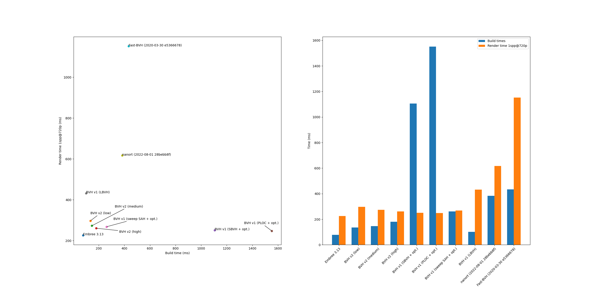

# BVH Construction and Traversal Library

> Note: This is the 2nd version of this library. Check the `v1` branch for the older, first version
> of this library.

This library is a small, standalone library for BVH construction and traversal. It is licensed
under the MIT license.

(Scene by Blend Swap user MaTTeSr, available [here](https://www.blendswap.com/blend/18762),
distributed under CC-BY 3.0)

## Performance

Here is a comparison of this library with other alternatives
([Embree](https://github.com/embree/embree),
[Fast-BVH](https://github.com/brandonpelfrey/Fast-BVH), and
[nanort](https://github.com/lighttransport/nanort)):

## Features

Here is a list of features supported by this library (changes from `v1` are indicated with [NEW]):

- [NEW] C++20 interface using `std::span` instead of raw pointers,
- Low-level API with direct access to various builders,
- [NEW] High-level `DefaultBuilder` API which selects the best builder depending on the desired
  BVH quality level.
- High-quality, single-threaded sweeping SAH builder,
- Fast, medium-quality, single-threaded binned SAH builder inspired by
  "On Fast Construction of SAH-based Bounding Volume Hierarchies", by I. Wald,
- Fast, high-quality, multithreaded mini-tree BVH builder inspired by
  "Rapid Bounding Volume Hierarchy Generation using Mini Trees", by P. Ganestam et al.,
- Reinsertion optimizer based on "Parallel Reinsertion for Bounding Volume Hierarchy
  Optimization", by D. Meister and J. Bittner,
- Fast and robust traversal algorithm using "Robust BVH Ray Traversal", by T. Ize.
- Fast ray-triangle intersection algorithm based on
  "Fast, Minimum Storage Ray/Triangle Intersection", by T. Möller and B. Trumbore,
- [NEW] Surface area traversal order heuristic for shadow rays based on
  "SATO: Surface Area Traversal Order for Shadow Ray Tracing", by J. Nah and D. Manocha,
- Fast ray-sphere intersection routine,
- [NEW] Serialization/deserialization interface,
- [NEW] Variable amount of dimensions (e.g. 2D, 3D, 4D BVHs are supported) and different scalar types
  (e.g. `float` or `double`),
- [NEW] Only depends on the standard library (parallelization uses a custom thread pool based on
  `std::thread`).

## Building

This library is header-only, and can be added as a CMake subproject by cloning or adding as this
repository as submodule, for instance in `<your-project>/contrib/bvh`, and then adding this to
`<your-project>/CMakeLists.txt`:

    add_subdirectory(contrib/bvh)
    target_link_library(my_project PUBLIC bvh)

If you want to build the examples, use:

    mkdir build
    cd build
    cmake .. -DCMAKE_BUILD_TYPE=<Debug|Release> -DENABLE_TESTING=ON
    cmake --build .

## Usage

The library contains several examples that are kept up-to-date with the API:

- A [basic example](test/simple_example.cpp) that traces one ray on a scene made of a couple of triangles,
- A [benchmarking utility](test/benchmark.cpp) that showcases what the library can do.
- A [serialization test](test/serialize.cpp) that shows how to save and load a BVH from a file.
